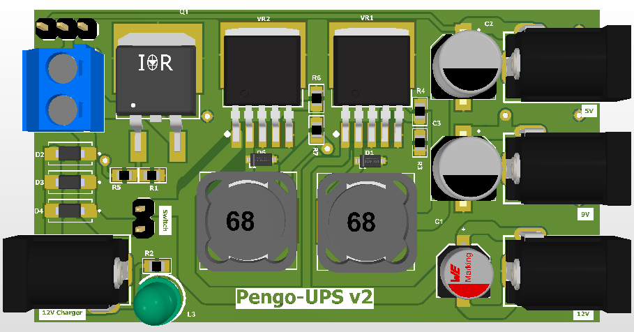

# Pengo-UPS v2 – Router UPS (5V/9V Buck Converter)

    

  
*(3D PCB Front View)*  

  
*(Full Schematic Diagram)*  

---

## 📌 Project Overview
**Pengo-UPS v2** is a compact **DC UPS (Uninterruptible Power Supply)** designed for routers, modems, and small electronics that require **stable 5V or 9V output**.  

It ensures your internet and network devices keep running during power outages by switching seamlessly to a backup battery.  
The circuit uses **LM2596 buck converters** for regulated outputs and a **TTP223 touch switch + IRFZ44 MOSFET** for manual ON/OFF control.

---

## ⚡ Features
- 🔋 **12V Battery Input** (Lead-acid or Li-ion supported)  
- 🔌 **12V Charger Support**  
- 🖐️ **Touch ON/OFF Control** (via TTP223 + IRFZ44 MOSFET)  
- ⚙️ **Dual Buck Converters (LM2596)** for **5V and 9V outputs**  
- 📦 Compact PCB design with 2 layers  
- 🔧 Reverse polarity and overcurrent protection  
- 📡 Ideal for **Routers, Modems, IoT devices, and Microcontrollers**  

---

## 🖥️ Circuit Explanation

### 🖐️ Power Control (ON/OFF Section)
- **TTP223 Touch Sensor Module**: Acts as the main switch input.  
- **Q1 (IRFZ44 MOSFET)**: Controlled by the TTP223, it connects/disconnects the supply (VCC) to the buck converters.  
- **R5 (100kΩ pull-down resistor)**: Ensures MOSFET gate stays LOW when the touch sensor is off.  

This allows you to **turn the UPS ON or OFF by simply touching the TTP223 sensor**.

---

### 🔌 Input Section
- **P1/P2 Connectors**: For **12V battery** and **12V charger input**.  
- **C1 (Filter Capacitor)**: Smooths the incoming DC supply.  
- **D2, D3, D4 (Schottky Diodes, 40V/5A)**: Provide battery isolation and prevent reverse current.  

---

### ⚡ 5V Buck Converter (VR1 Section)
- **VR1 (LM2596-5.0)**: Fixed 5V output regulator.  
- **L1 (33µH Inductor)** + **D1 (Schottky Diode)**: For buck conversion.  
- **C2 (220µF)**: Output filter capacitor.  
- **U1 Connector**: Provides stable **5V output**.  

---

### ⚡ 9V Buck Converter (VR2 Section)
- **VR2 (LM2596-ADJ)**: Adjustable regulator set to **9V**.  
- **R6 (2kΩ) and R7 (12.7kΩ)**: Feedback resistors that set output to 9V.  
- **L2 (33µH Inductor)** + **D6 (Schottky Diode)**: Buck converter components.  
- **C3 (220µF)**: Output capacitor.  
- **U3 Connector**: Provides regulated **9V output**.  

---

### 🔦 Indicators
- **L3 (LED) + R2 (1kΩ)**: Indicates UPS is ON (MOSFET active).  

---

## 📐 PCB Design
- **2-layer design** for compact size.  
- Combination of **SMD + through-hole** components.  
- Wide copper traces for handling higher current.  
- Thermal pads for LM2596 ICs.  

---

## 🛠️ Applications
- Router / Modem UPS  
- IoT Device Backup  
- Arduino / ESP32 / STM32 Projects  
- Small DC Electronics requiring uninterrupted 5V or 9V  

---

## 📂 Repository Structure
/Pengo-UPS-v2
│── README.md # Documentation
│── 3d-pcb-front.png # 3D PCB Render
│── 821779ca-schematic.png # Full Schematic Diagram
│── pcb-layout.png # PCB Layout Image (optional)
│── schematic.pdf # Detailed schematic (optional)
│── gerber/ # PCB Manufacturing Files
│── bom.csv # Bill of Materials

---

## 🔧 How to Use
1. Connect a **12V battery** at the battery input terminal.  
2. Plug in a **12V adapter/charger** for charging.  
3. Tap the **TTP223 touch sensor** to turn ON the circuit (MOSFET activates).  
4. Connect your **router/modem to the 9V output**.  
5. Connect your **IoT/MCU device to the 5V output**.  
6. Tap the **TTP223 again to turn OFF** the UPS when not needed.  

---

## 📜 License
This project is licensed under the **MIT License**.  
You are free to use, modify, and share it with proper attribution.  
